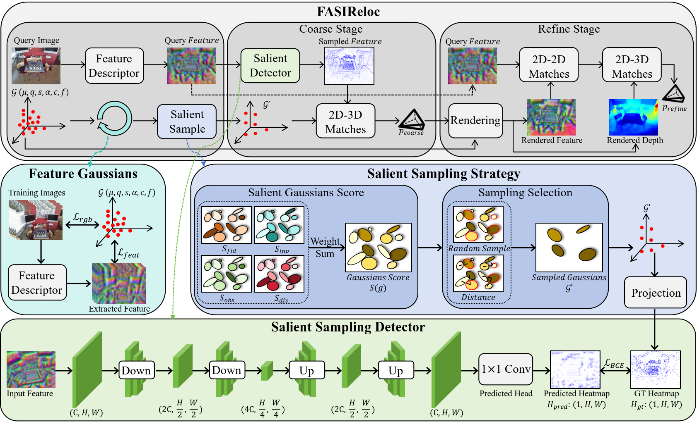
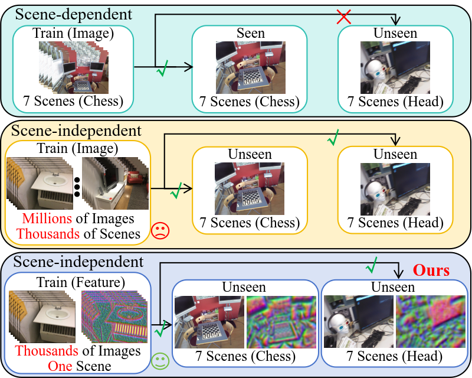
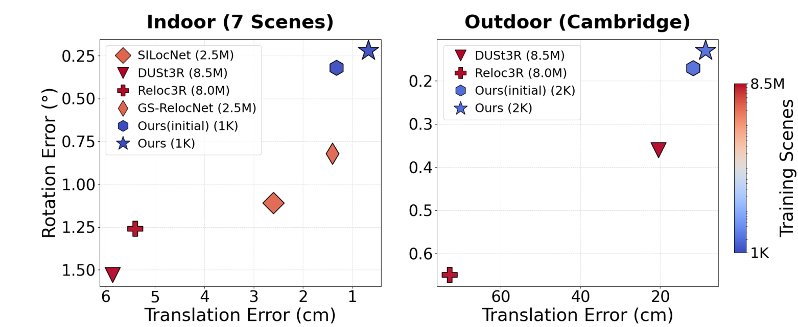

# One-to-All Relocalization: Feature-Anchored Scene-Independent Camera Relocalization via Salient Sampling and Regression of Feature Gaussians

## Overview

<center>   </center>


## Abstract

Camera relocalization currently struggles with a dilemma between accuracy and adaptability: scene-dependent methods offer high precision but fail to generalize, while scene-independent alternatives require extensive training data and often suffer from suboptimal accuracy.
In this work, we aim to bridge this gap by achieving both high accuracy and strong generalization. Our key idea is to base localization on transferable feature-level invariants rather than image appearance, enabling accurate relocalization in unseen scenes even when trained on a single scene.
We propose FASIReloc, a feature-anchored relocalization framework built on feature Gaussian primitives that encode transferable 3D structures. FASIReloc adopts a coarse-to-fine pipeline: a saliency-driven sampling strategy selects stable and representative Gaussian anchors, and a lightweight scene-independent network establishes reliable 2D-3D correspondences for initial pose estimation. The pose is then refined through dense feature alignment for improved accuracy.
Experiments on 7 Scenes and Cambridge Landmarks demonstrate state-of-the-art performance in both scene-dependent and scene-independent settings. In the scene-independent setting, FASIReloc reduces median translation and rotation errors by 51% and 73% on 7 Scenes, and 45% and 45% on Cambridge Landmarks, compared to prior best methods. Notably, these results are achieved when training on only a single scene, highlighting strong data efficiency and cross-scene generalization.


## Comparison

<p align="center">
  
  
</p>

## Environmental Setup

### Installation

Our experiments were conducted on **Ubuntu 22.04** with **CUDA 12.4** and **Python 3.8**.
While the codebase is expected to be compatible with similar configurations, it has not been extensively tested beyond the reported setup.

1. Clone the repository

   ```
   git clone https://github.com/junhaowei0524/FASIReloc.git  --recursive
   cd FASIReloc
   ```

2.  Create the environment and install dependencies

```bash
conda create -n fasireloc python=3.8 -y
conda activate fasireloc

# Install PyTorch
pip install torch==2.4.1 torchvision==0.19.1 torchaudio==2.4.1 \
  --index-url https://download.pytorch.org/whl/cu124

# Install remaining dependencies
pip install -r requirements.txt --no-deps

# Install submodules
pip install -e submodules/simple-knn
pip install -e submodules/gsplat
```

### Dataset

1. Data structure

   All datasets are organized under the `datasets/` directory of the project page, following a unified directory structure:

   ```text
   datasets/
   ├── dataset_name1/
   │   ├── scene1/
   │   └── scene2/
   ├── dataset_name2/
   │   ├── scene1/
   │   └── scene2/
   └── ...

2. Download public data

   We use four publicly available datasets:

   - [Microsoft 7-Scenes](https://www.microsoft.com/en-us/research/project/rgb-d-dataset-7-scenes/)

   - [Cambridge Landmarks](https://www.repository.cam.ac.uk/handle/1810/251342/)

   - [Scannet](https://github.com/ScanNet/ScanNet)

   - [MegaDepth](https://www.cs.cornell.edu/projects/megadepth/)

   Due to licensing restrictions, we do not redistribute the datasets. Please download them from the official sources above and place them into the corresponding subdirectories under `datasets/`.

   ```markdown
   For example:
   
   datasets/
   ├── 7scenes/
   │   ├── chess/
   │   └── fire/
   ├── cambridge/
   │   ├── kings_college/
   │   └── old_hospital/

### Training 

#### Scene_independent

```bash
# train on ScanNet (single scene)
bash script/train_independent_scannet_single.sh

# train on MedaDepth (single scene)
bash script/train_independent_megadepth_single.sh
```

### Evaluation

#### Scene-independent

You can evaluate the model either using your own trained model or by using our pre-trained ScanNet and MegaDepth models provided in the `pretrained` folders.

```bash
# evaluate on 7 Scenes
bash script/evaluate_independent_7scenes.sh

# evaluate on Cambridge Landmarks 
bash script/evaluate_independent_cambridge.sh
```


## Note

- This repository currently provides training and testing code for a subset of scenes under scene-independent conditions. The complete codebase and pre-trained models will be released upon acceptance of the paper.
- AR demonstration videos for some scenes can be found in the Supplementary Material.
